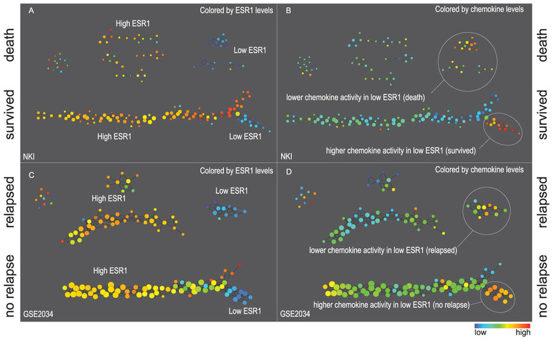
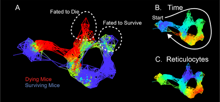
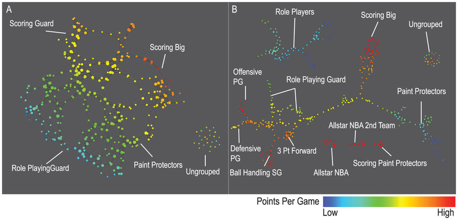
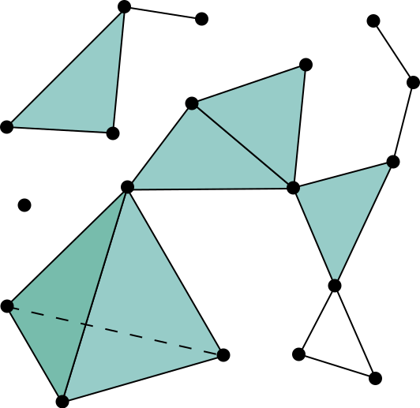

class: center, middle

# From Reeb graph to Mapper
## An Introduction to Topological Data Analysis
Nathaniel Saul

Nathaniel Saul | Washington State University - Vancouver

---
layout: true

# Motivation

Nathaniel Saul | Washington State University - Vancouver

---

.left-column[
## Big data
]
.right-column[

]

???

Intro:
Start out talking about big data, machine learning, the hype machine.
It's clear that we have tons of data and we have tons of processing power, the question is whether we can pull any useful insights from the data.  

The hype comes from the assumption that this is useful and
we can learn from this massive data..

Middle:
need to talk about topological invariants about the letters

talk about how we assume data has an underlying shape and from the data, we can learn the topological invariants of the shape.

talk about how the reeb graph and mapper are a compression of the underlying object that still captures the essential topological information.
and, we then look features of these objects,
such as flares and loops

Mention how the reeb graph can be generalized to Rd and the
mapper could have overlapping 2d rectangles or higher, not just intervals along one dimension

Synthesis/conclusion

mapper is a great exploratory tool,
we've seen how it can construct a compressed summary that captures the topological invariants of the space.

imagine you had a very high dimensional object where you couldn't easily look at it and see there is a loop, this construction would be useful then.

It is not a panacea for data analytics, but it is a useful tool for exploratory analysis that should be in your toolbox

---

.left-column[
## Big data
## Moore's Law

]
.right-column[

.footnote[Photos thanks to [ChillOutPoint.com](http://www.chilloutpoint.com/featured/old-photos-of-the-first-generation-of-computers.html) and
[EBuyer.com](http://www.ebuyer.com/blog/2014/04/introducing-kids-to-technology/)]

]

???

Processing power for computers will double every two years.

LOTS of data and LOTS of processing power... two essential ingredients, no recipe.

---

##  TOPOLOGY!

---

.left-column[
  ## Topology
  ### - How?
]
.right-column[

.footnote[Bruce Nauman, Fingers and Holes, 1994]

]

???
A topologist can't even tell the difference between their coffee mug and their donut,
how are they supposed to make sense of a whole bunch of data?!

---

.left-column[
  ## Topology
  ### - How?
]
.right-column[.center[

#  \\( \mathcal{A}  \sim A\\)

#  \\( \mathcal{B}  \sim B\\)

#  \\( \mathcal{C}  \sim C\\)
]
]

???

read or recognize characters

topology is a natural way to characterize classes of letters,

it can distinguish loops and allows for deformations

---

.left-column[
  ## Topology
  ### - How?
]
.right-column[
Topology is useful because

* We can assume data has shape and
* Shape is important.
* Also ...

]

???
The data is  sampled from an underlying shape that we want to figure out!

---

layout: true
class: center
# Pretty Pictures

Nathaniel Saul | Washington State University - Vancouver

---

.footnote[Lum et al, Extracting insights from the shape of
complex data using topology, 2013]

---

.footnote[Torres et al, Tracking Resilience to Infections by Mapping Disease Space, 2016]

---

.footnote[Lum et al, Extracting insights from the shape of
complex data using topology, 2013]

---
layout: false
class: center, middle

# From **Reeb graph** to Mapper

Nathaniel Saul | Washington State University - Vancouver

???

Going to start by describing from topological data analysis that has been used to study and compare shapes...

then I'm going to show you it's discrete counterpart that works on point clouds of data.

---

layout: true

# Reeb graph

Nathaniel Saul | Washington State University - Vancouver

---

.left-column[
]
.right-column[
Studies a topological space through a real valued function on that space.

]

---

.left-column[
  ## A function
]
.right-column[
Studies a topological space through a real valued function on that space.

$$ f: X \to \mathbb{R} $$

]
---

.left-column[
  ## A function
  ## A relation

]
.right-column[
Studies a topological space through a real valued function on that space.

$$ f: X \to \mathbb{R} $$

Let \\(a \sim b \\) for \\(a,b \in X\\) if \\(f(a)\\) is connected to \\(f(b)\\) within the same level set.

]

---

.left-column[
  ## A function
  ## A relation
  ### - Connected

]
.right-column[

Two points are path **connected** if you can draw a line from one to the other without leaving the space.

]

???

* connected means we can draw a path from one point to the other and never leave the space.
* Represent each leg of the chair at each height by one point

---

.left-column[
  ## A function
  ## A relation
  ### - Connected
  ### - Level Sets

]
.right-column[

The **level set** at each \\(a \in \mathbb{R}\\) is the set
$$\\{ x \in X \mid f(x) = a \\}$$

]

???
* a function from our object to the real line, maybe it's defined as height
* all the pieces that are at the same height
* these level sets are in the domain!

---

.left-column[
## A function
## A relation
### - Connected
### - Level Sets
## A Reeb graph
]
.right-column[

The Reeb graph is the quotient space \\(X / \sim\\) endowed with the quotient topology.

]

???

which is just a fancy way of saying "collapse connected components of level sets together"

---

layout: true
class: center, middle

Nathaniel Saul | Washington State University - Vancouver

---

---

.footnote[.red.bold[\*]Edelsbrunner and Harer, Computational Topology]

---

---

layout: true

# Reeb graph

Nathaniel Saul | Washington State University - Vancouver

---

.left-column[
## A function
## A relation
## A Reeb graph
## Point Cloud?
]
.right-column[

What happens when we move to real data?

]
---

.left-column[
## A function
## A relation
## A Reeb graph
## Point Cloud?
]
.right-column[

Try to draw the Reeb graph of this

  <!-- /the chart goes here -->

]

---
.left-half[

  <!-- /the chart goes here -->

]
.right-half[
* Each point is an isolated point
]

---
.left-half[

  <!-- /the chart goes here -->

]
.right-half[
* Each point is an isolated point

  - so we have no connected components.

]

---
.left-half[

  <!-- /the chart goes here -->

]
.right-half[
* Each point is an isolated point

  - so we have no connected components.

* Each level set is disconnected from the rest
]

---
.left-half[

  <!-- /the chart goes here -->

]
.right-half[
* Each point is an isolated point
  - so we have no connected components.

* Each level set is disconnected from the rest
  - so it's not meaningful to string them together.
]

---
layout: false
class: center, middle

# From Reeb graph to **Mapper**

Nathaniel Saul | Washington State University - Vancouver

???

Let's look at the discrete counterpart of the Reeb graph

---
class: middle, center

## Simplicial Complex
## Nerve
## Mapper

---

layout: false
# Simplicial Complex

.footnote[[Trever Goodchild](https://en.wikipedia.org/wiki/Simplicial_complex#/media/File:Simplicial_complex_example.svg)]

---

layout: true
# Nerve

Nathaniel Saul | Washington State University - Vancouver

---

.left-column[

]
.right-column[

Given open sets \\( \{\mathcal{O}_i\} \\) indexed over a set \\(I\\), the nerve is defined as

$$ N(\mathcal{O}) = \left\\{ J \subseteq I \mid \bigcap_{j\in J} \mathcal{O}_j \ne \emptyset \right\\} $$

]

---

.left-column[

]
.right-column[

Given open sets \\( \{\mathcal{O}_i\} \\) indexed over a set \\(I\\), the nerve is defined as

$$ N(\mathcal{O}) = \left\\{ J \subseteq I \mid \bigcap_{j\in J} \mathcal{O}_j \ne \emptyset \right\\} $$

### This is a simplicial complex!

]

---

.left-column[
## Open cover

]
.right-column[

.footnote[.red.bold[\*]James Salvatore, Applying Topology to Data]

]

---

.left-column[
## Open cover
## Add vertices

]
.right-column[

.footnote[.red.bold[\*]James Salvatore, Applying Topology to Data]

]

---

.left-column[

## Open cover
## Add vertices
## Add simplices
]
.right-column[

.footnote[.red.bold[\*]James Salvatore, Applying Topology to Data]

]

---

.left-column[

## Open cover
## Add vertices
## Add simplices
]
.right-column[

.footnote[.red.bold[\*]James Salvatore, Applying Topology to Data]

]

---

layout: true
# Mapper

Nathaniel Saul | Washington State University - Vancouver

---

.left-column[

]
.right-column[

  <!-- /the chart goes here -->

]

---

.left-column[
  ## Overlapping Intervals
]
.right-column[

  <!-- /the chart goes here -->

]

---

.left-column[
  ## Overlapping Intervals
  ## Partial Clustering
]

.right-column[

  <!-- /the chart goes here -->

]

---

.left-column[
  ## Overlapping Intervals
  ## Partial Clustering
]

.right-column[

  <!-- /the chart goes here -->

]

---

.left-column[
## Overlapping Intervals
## Partial Clustering
## Nerve of Clusters
]
.right-column[

Build nerve from partial clusters!
 - Each cluster is a vertex
 - Clusters overlap if they share points in common

*Note:* clusters will only share points if they are in different intervals.
]

---

.left-half[

  <!-- /the chart goes here -->

]

.right-half[

]

---

.left-half[

  <!-- /the chart goes here -->

]

.right-half[

<!-- simplicial complex goes here -->

]

---

.left-half[

  <!-- /the chart goes here -->

]

.right-half[

<!-- simplicial complex goes here -->

]

---

.left-half[

  <!-- /the chart goes here -->

]

.right-half[

<!-- simplicial complex goes here -->

]

---

---

???
Circle back to detail one case study from before -

talk in more detail of what the mapper shows in the data

This is not the pancea of data analysis,

 it is a great tool you should
have in your toolbox.

Along with clustering, dimensionality reductions, etc.

---
layout: false
name: last-page

class: center, middle

# Thank you

Email: [nathaniel.saul@wsu.edu](nathaniel.saul@wsu.edu)

Twitter: [@\_ropthe\_](https://twitter.com/_ropthe_)

Github: [sauln](https://github.com/sauln/)

---

# Bibliography

H. Edelsbrunner, J. Harer, Computational Topology: an introduction, *AMS* 2010

G. Singh, F. Memoli, and G. Carlsson. Topological Methods for the analysis of high dimensional data sets and 3D object recognition. *Eurograph. Sympos. Point-Based Graphics* pg 91-100, 2007.

Lum et al. Extracting insights from the shape of complex data using Topology, *Nature Scientific Reports*, 2013

Torres et al, Tracking Resilience to Infections by Mapping Disease Space, *PLOS Biology*, 2016
