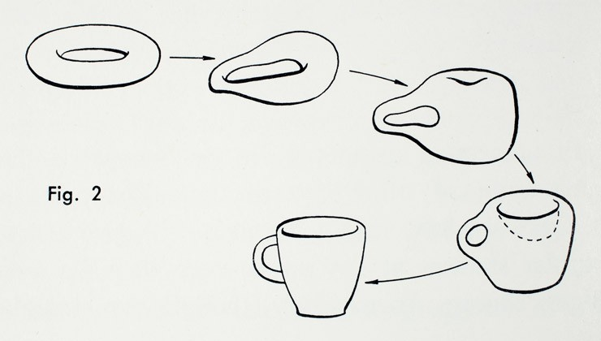

class: center, middle

# From Reeb graph to Mapper

Nathaniel Saul
<div class="my-footer"><span>Nathaniel Saul | Washington State University - Vancouver</span></div>

---
layout: true

# Motivation
<div class="my-footer"><span>Nathaniel Saul | Washington State University - Vancouver</span></div>


---

.left-column[
  ## Big data

]
.right-column[
How big?
]

---

.left-column[
  ## Big data
### - hype train
]
.right-column[
Sooo much hype.. but it's really so big
]


---

.left-column[
  ## Big data
### - hype train
### - Moore's Law
]
.right-column[
processing power for computers will double every two years.
]

---

.left-column[
  ## Big data
### - hype train
### - Moore's Law
### - Now what?
]
.right-column[
LOTS of data and LOTS of processing power... two essential ingredients, no recipe.
]


---

##  TOPOLOGY!


---

.left-column[
  ## Topology
  ### - How?
]
.right-column[

A topologist can't even tell the difference between their coffee mug and their donut,
how are they supposed to make sense of a whole bunch of data?!



]


---

.left-column[
  ## Topology
  ### - How?
]
.right-column[
* assume data has shape and that the shape is important
* use local information to describe global shape
* pretty pictures

]


---

layout: false

pretty pictures
<div class="my-footer"><span>Nathaniel Saul | Washington State University - Vancouver</span></div>


---

layout: true

# Reeb graph
<div class="my-footer"><span>Nathaniel Saul | Washington State University - Vancouver</span></div>

---

.left-column[
  ## What
]
.right-column[
Studies a function on a space.

]


---

.left-column[
  ## A function
]
.right-column[
Studies a function on a space through its level sets.

$$ f: X \to \mathbb{R} $$

]
---


.left-column[
  ## A function
  ## A relation

]
.right-column[
Studies a function on a space through its level sets.

$$ f: X \to \mathbb{R} $$

Let $a \sim b $ for $a,b \in X$ if $f(a)$ is connected to $f(b)$ within the same level set.

]

---


.left-column[
  ## A function
  ## A relation
  ## A Reeb graph
]
.right-column[
Studies a topological space through a function that maps the space to the real line.

$$ f: X \to \mathbb{R} $$

Let $a \sim b $ for $a,b \in X$ if $f(a)$ is connected to $f(b)$ within the same level set.

Then the Reeb graph is the quotient space $X / \sim$ endowed with the quotient topology.

]

---


# Duh

---

# (Not) Duh
--

Let's break this down
---

.left-column[
  ## A function
  ## A relation
  ## A Reeb graph
]
.right-column[
Studies a topological space through a function that maps the space to the real line.

$$ f: X \to \mathbb{R} $$

Let $a \sim b $ for $a,b \in X$ if $f(a)$ is connected to $f(b)$ within the same level set.

Then the Reeb graph is the quotient space $X / \sim$ endowed with the quotient topology.
]

---

.left-column[
  ## Level set
]
.right-column[
Say we have a function `\(f:X \to \mathbb{R}\)` from
(a function from our object [a chair] to the real line, maybe it's defined as height)

the *level set* at each `\(a \in \mathbb{R}\)` is defined as
$$\{ x \in X \mid f(x) = a \}$$

(all the pieces that are at the same height)

]

---
.left-column[
  ## Level set
  ## Connected components
]
.right-column[
Let \(\sim\) be a relation on $X$ such that for $a, b\in X$, $a\sim b$ if they are in the same connected component of a level set.

(Represent each leg of the chair at each height by one point)

]

---
.left-column[
  ## Level set
  ## Connected components
  ## Pretty pictures
]
.right-column[
  White board plz
]


---

layout: true
# Mapper
<div class="my-footer"><span>Nathaniel Saul | Washington State University - Vancouver</span></div>

---

* Point cloud - sampling from some shape
* How to we build a Reeb graph?  each data point has measure zero! each point is isolated!
  * no connected components - level sets aren't attached in any meaningful way
* have to approximate
  * instead of level sets, look at overlapping intervals
    * intervals give at least some data points, overlapping so we know how to stitch them together
  * clusters instead of connected components.
  * represent by a simplicial complex.


  $$\sum a_n $$
---

Is Mapper more?

* woah now we have totally new things to talk about...
  * cover of codomain
  * simplicial complex
  * more than just a one dimensional range


name: inverse
layout: true
class: center, middle, inverse
---
#remark
[ri-mahrk]
.footnote[Go directly to [project site](https://github.com/gnab/remark)]
---
## What is it and why should I be using it?
---
layout: false
.left-column[
  ## What is it?
]
.right-column[
  A simple, in-browser, Markdown-driven slideshow tool targeted at people who know their way around HTML and CSS, featuring:

- Markdown formatting, with smart extensions

- Presenter mode, with cloned slideshow view

- Syntax highlighting, supporting a range of languages

- Slide scaling, thus similar appearance on all devices / resolutions .red[*]

- Touch support for smart phones and pads, i.e. swipe to navigate slides

.footnote[.red[*] At least browsers try their best]
]
---
.left-column[
## What is it?
## Why use it?
]
.right-column[
If your ideal slideshow creation workflow contains any of the following steps:

- Just write what's on your mind

- Do some basic styling

- Easily collaborate with others

- Share with and show to everyone

Then remark might be perfect for your next.red[*] slideshow!

.footnote[.red[*] You probably want to convert existing slideshows as well]
]
---
.left-column[
  ## What is it?
  ## Why use it?
]
.right-column[
As the slideshow is expressed using Markdown, you may:

- Focus on the content, expressing yourself in next to plain text not worrying what flashy graphics and disturbing effects to put where

As the slideshow is actually an HTML document, you may:

- Display it in any decent browser

- Style it using regular CSS, just like any other HTML content

- Use it offline!

As the slideshow is contained in a plain file, you may:

- Store it wherever you like; on your computer, hosted from your Dropbox, hosted on Github Pages alongside the stuff you're presenting...

- Easily collaborate with others, keeping track of changes using your favourite SCM tool, like Git or Mercurial
]
---
template: inverse

## How does it work, then?
---
name: how

.left-column[
  ## How does it work?
### - Markdown
]
.right-column[
A Markdown-formatted chunk of text is transformed into individual slides by JavaScript running in the browser:

```remark
# Slide 1
This is slide 1

---

# Slide 2
This is slide 2
```

.slides[
  .first[
  ### Slide 1
  This is slide 1
  ]
  .second[
  ### Slide 2
  This is slide 2
  ]
]

Regular Markdown rules apply with only a single exception:

  - A line containing three dashes constitutes a new slide
  (not a horizontal rule, `&lt;hr /&gt;`)

Have a look at the [Markdown website](http://daringfireball.net/projects/markdown/) if you're not familiar with Markdown formatting.
]
---
.left-column[
  ## How does it work?
  ### - Markdown
  ### - Inside HTML
]
.right-column[
A simple HTML document is needed for hosting the styles, Markdown and the generated slides themselves:

```xml
<!DOCTYPE html>
<html>
  <head>
    <style type="text/css">
      /* Slideshow styles */
    </style>
  </head>
  <body>
*    <textarea id="source">
      <!-- Slideshow Markdown -->
    &lt;/textarea&gt;
*    <script src="remark.js">
    </script>
    <script>
*      var slideshow = remark.create();
    </script>
  </body>
</html>
```

You may download remark to have your slideshow not depend on any online resources, or reference the [latest version](http://remarkjs.com/downloads/remark-latest.min.js) online directly.
]
---
template: inverse

## Of course, Markdown can only go so far.
---
.left-column[
  ## Markdown extensions
]
.right-column[
To help out with slide layout and formatting, a few Markdown extensions have been included:

- Slide properties, for naming, styling and templating slides

- Content classes, for styling specific content

- Syntax highlighting, supporting a range of languages
]

---
.left-column[
  ## Markdown extensions
  ### - Slide properties
]
.right-column[
Initial lines containing key-value pairs are extracted as slide properties:

```remark
name: agenda
class: middle, center

# Agenda

The name of this slide is {{ name }}.
```

Slide properties serve multiple purposes:

* Naming and styling slides using properties `name` and `class`

* Using slides as templates using properties `template` and `layout`

* Expansion of `{{ property }}` expressions to property values

See the [complete list](https://github.com/gnab/remark/wiki/Markdown#slide-properties) of slide properties.
]
---
.left-column[
  ## Markdown extensions
  ### - Slide properties
  ### - Content classes
]
.right-column[
Any occurences of one or more dotted CSS class names followed by square brackets are replaced with the contents of the brackets with the specified classes applied:

```remark
.footnote[.red.bold[*] Important footnote]
```

Resulting HTML extract:

```xml
<span class="footnote">
  <span class="red bold">*</span> Important footnote
</span>
```
]
---
.left-column[
  ## Markdown extensions
  ### - Slide properties
  ### - Content classes
  ### - Syntax Highlighting
]
.right-column[
Code blocks can be syntax highlighted by specifying a language from the set of [supported languages](https://github.com/gnab/remark/wiki/Configuration#highlighting).

Using [GFM](http://github.github.com/github-flavored-markdown/) fenced code blocks you can easily specify highlighting language:

.pull-left[

<pre><code>```javascript
function add(a, b)
  return a + b
end
```</code></pre>
]
.pull-right[

<pre><code>```ruby
def add(a, b)
  a + b
end
```</code></pre>
]

A number of highlighting [styles](https://github.com/gnab/remark/wiki/Configuration#highlighting) are available, including several well-known themes from different editors and IDEs.

]
---
.left-column[
  ## Presenter mode
]
.right-column[
To help out with giving presentations, a presenter mode comprising the
following features is provided:

- Display of slide notes for the current slide, to help you remember
  key points

- Display of upcoming slide, to let you know what's coming

- Cloning of slideshow for viewing on extended display
]
---
.left-column[
  ## Presenter mode
  ### - Inline notes
]
.right-column[
Just like three dashes separate slides,
three question marks separate slide content from slide notes:

```
Slide 1 content

*???

Slide 1 notes

---

Slide 2 content

*???

Slide 2 notes
```

Slide notes are also treated as Markdown, and will be converted in the
same manner slide content is.

Pressing __P__ will toggle presenter mode.
]
???
Congratulations, you just toggled presenter mode!

Now press __P__ to toggle it back off.
---
.left-column[
  ## Presenter mode
  ### - Inline notes
  ### - Cloned view
]
.right-column[
Presenter mode of course makes no sense to the audience.

Creating a cloned view of your slideshow lets you:

- Move the cloned view to the extended display visible to the audience

- Put the original slideshow in presenter mode

- Navigate as usual, and the cloned view will automatically keep up with the original

Pressing __C__ will open a cloned view of the current slideshow in a new
browser window.
]
---
template: inverse

## It's time to get started!
---
.left-column[
  ## Getting started
]
.right-column[
Getting up and running is done in only a few steps:

1. Visit the [project site](http://github.com/gnab/remark)

2. Follow the steps in the Getting Started section

For more information on using remark, please check out the [wiki](https://github.com/gnab/remark/wiki) pages.
]
---
name: last-page
template: inverse

## That's all folks (for now)!

Slideshow created using [remark](http://github.com/gnab/remark).
