class: center, middle

# From Reeb graph to Mapper

Nathaniel Saul

Nathaniel Saul | Washington State University - Vancouver

---
layout: true

# Motivation

Nathaniel Saul | Washington State University - Vancouver

---

.left-column[
  ## Big data
### - hype train
### - Moore's Law
### - Now what?
]
.right-column[
Sooo much hype.. but it's really so big

Processing power for computers will double every two years.

LOTS of data and LOTS of processing power... two essential ingredients, no recipe.
]

---

##  TOPOLOGY!

---

.left-column[
  ## Topology
  ### - How?
]
.right-column[

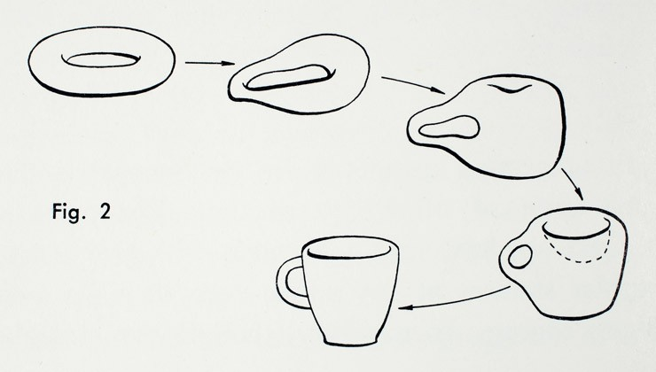

.footnote[.red.bold[\*]https://www.nga.gov/content/ngaweb/features/the-serial-impulse/bruce-nauman.html]

]

???
A topologist can't even tell the difference between their coffee mug and their donut,
how are they supposed to make sense of a whole bunch of data?!

---

.left-column[
  ## Topology
  ### - How?
]
.right-column[
Topology is useful because

* We can assume data has shape and that the shape is important.
* Use local information to describe global shape.

]

???
The data is  sampled from an underlying shape that we want to figure out!
---

layout: true
class: center
# Pretty Pictures

Nathaniel Saul | Washington State University - Vancouver

---
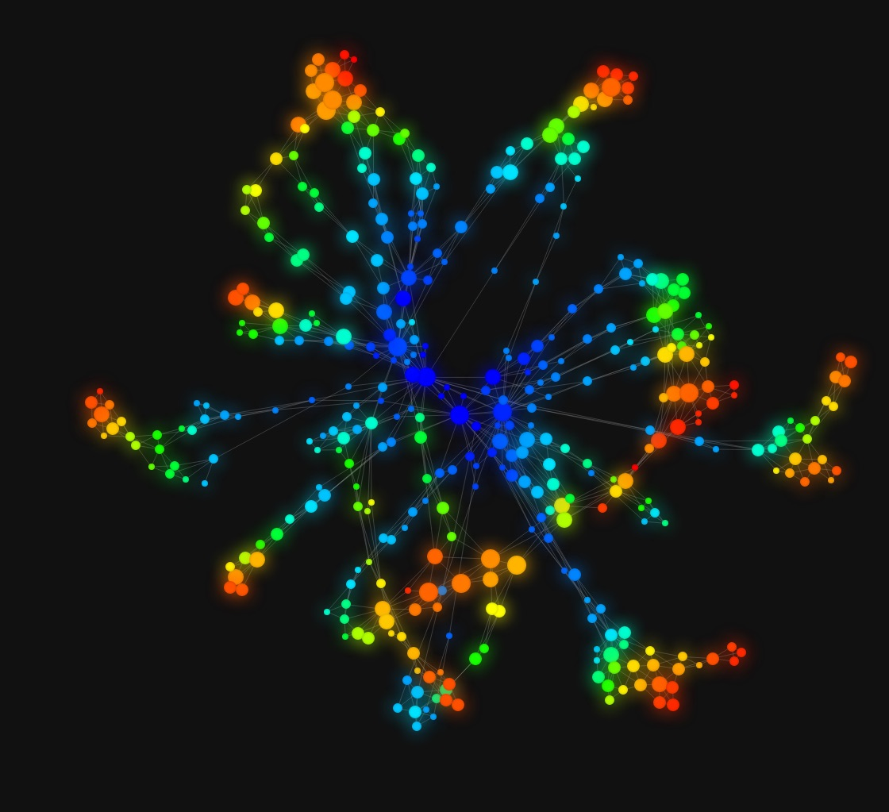

---
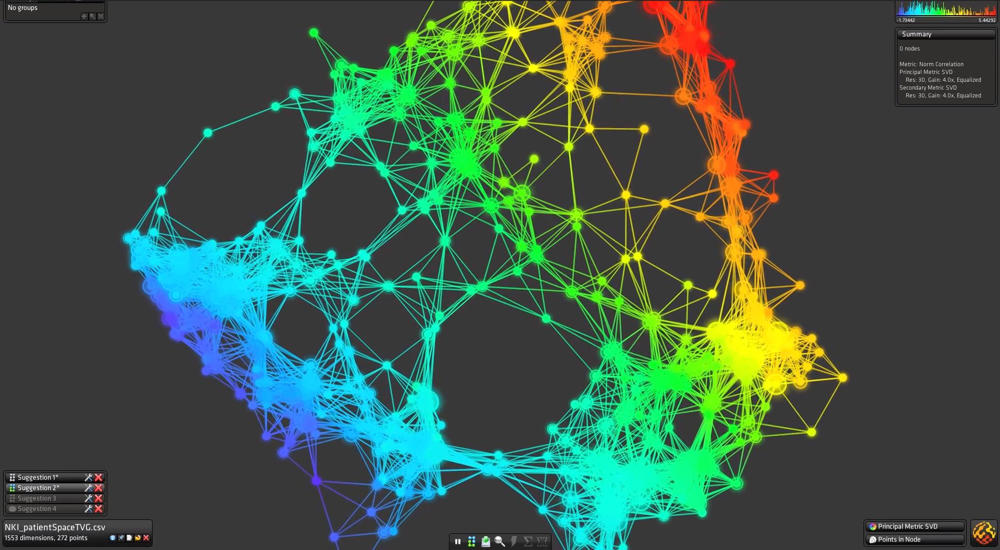

---
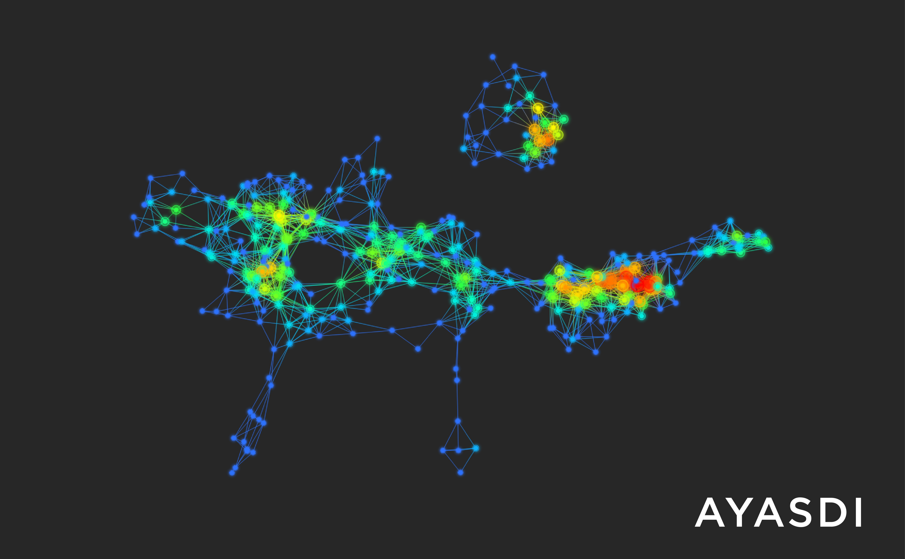

---
layout: false
class: center, middle

# From **Reeb graph** to Mapper

Nathaniel Saul | Washington State University - Vancouver

???

Going to start by describing from topological data analysis that has been used to study and compare shapes...

then I'm going to show you it's discrete counterpart that works on point clouds of data.

---

layout: true

# Reeb graph

Nathaniel Saul | Washington State University - Vancouver

---

.left-column[
  ## What
]
.right-column[
Studies a topological space through a real valued function on that space.

]

---

.left-column[
  ## A function
]
.right-column[
Studies a topological space through a real valued function on that space.

$$ f: X \to \mathbb{R} $$

]
---

.left-column[
  ## A function
  ## A relation

]
.right-column[
Studies a topological space through a real valued function on that space.

$$ f: X \to \mathbb{R} $$

Let \\(a \sim b \\) for \\(a,b \in X\\) if \\(f(a)\\) is connected to \\(f(b)\\) within the same level set.

]

---

.left-column[
  ## A function
  ## A relation
  ### - Connected

]
.right-column[

Two points are path **connected** if you can draw a line from one to the other without leaving the space.
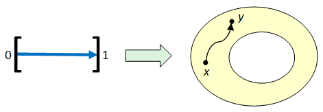

]

???

* connected means we can draw a path from one point to the other and never leave the space.
* Represent each leg of the chair at each height by one point

---

.left-column[
  ## A function
  ## A relation
  ### - Connected Components
  ### - Level Sets

]
.right-column[

Say we have a function \\(f:X \to \mathbb{R}\\) from

the **level set** at each \\(a \in \mathbb{R}\\) is defined as
$$\\{ x \in X \mid f(x) = a \\}$$
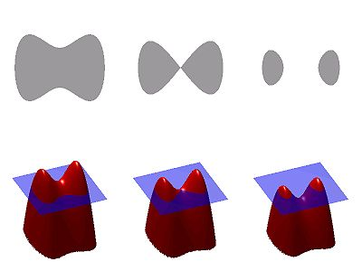

]

???
* a function from our object to the real line, maybe it's defined as height
* all the pieces that are at the same height
* these level sets are in the domain!

---

.left-column[
  ## A function
  ## A relation
  ### - Connected Components
  ### - Level Sets
  ## A Reeb graph
]
.right-column[

The Reeb graph is the quotient space \\(X / \sim\\) endowed with the quotient topology.

]

???

which is just a fancy way of saying "collapse connected components of level sets together"
---

layout: true
class: center, middle

Nathaniel Saul | Washington State University - Vancouver

---

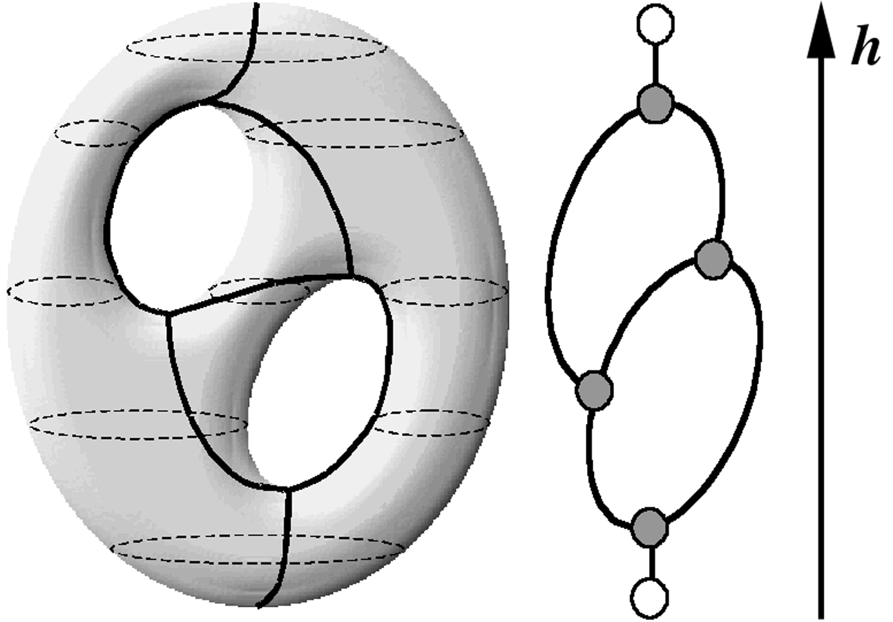
---

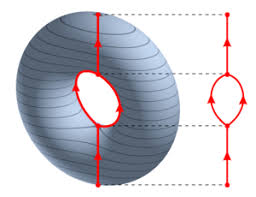

---

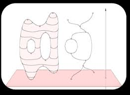
---

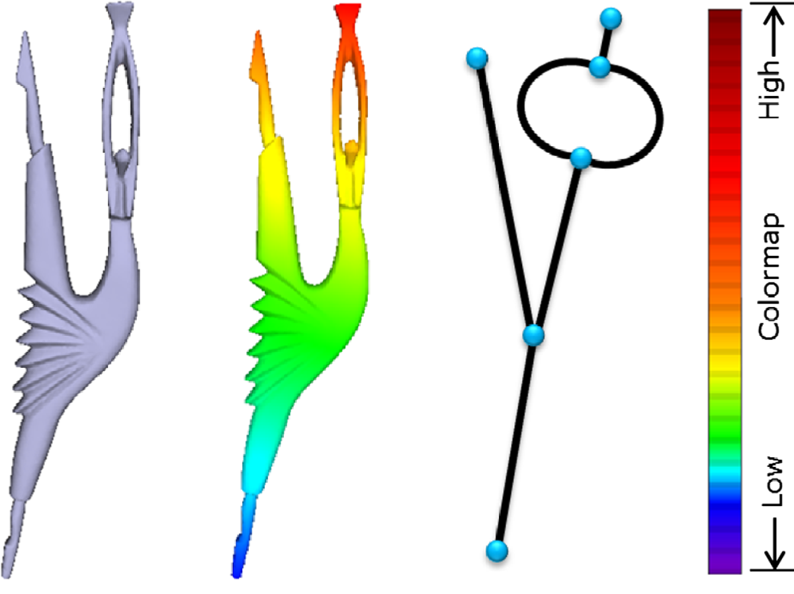

---

layout: true

# Reeb graph

Nathaniel Saul | Washington State University - Vancouver

---

.left-column[
  ## A function
  ## A relation
  ## A Reeb graph
  ## Point Cloud?
]
.right-column[

What happens when we move to real data?

]
---

.left-column[
  ## A function
  ## A relation
  ## A Reeb graph
  ## Point Cloud?
]
.right-column[

Try to draw the Reeb graph of this

  <!-- /the chart goes here -->

]

---
.left-half[

  <!-- /the chart goes here -->

]
.right-half[
* Each point is an isolated point
]

---
.left-half[

  <!-- /the chart goes here -->

]
.right-half[
* Each point is an isolated point

  - so we have no connected components.

]

---
.left-half[

  <!-- /the chart goes here -->

]
.right-half[
* Each point is an isolated point

  - so we have no connected components.

* Each level set is disconnected from the rest
]

---
.left-half[

  <!-- /the chart goes here -->

]
.right-half[
* Each point is an isolated point
  - so we have no connected components.

* Each level set is disconnected from the rest
  - so it's not meaningful to string them together.
]

---
layout: false
class: center, middle

# From Reeb graph to **Mapper**

Nathaniel Saul | Washington State University - Vancouver

???

Let's look at the discrete counterpart of the Reeb graph

---

layout: true
# Mapper

Nathaniel Saul | Washington State University - Vancouver

---

.left-column[
## Nerve
### - Open cover

]
.right-column[

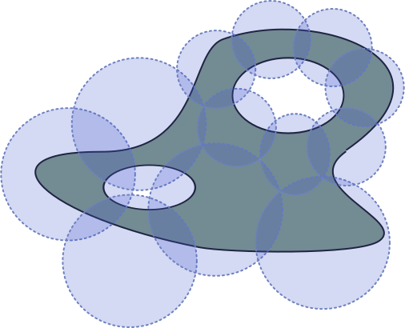
.footnote[.red.bold[\*]http://www.dyinglovegrape.com/math/topology_data_1.php]
]

---

.left-column[
## Nerve
### - Open cover
### - Add vertices

]
.right-column[

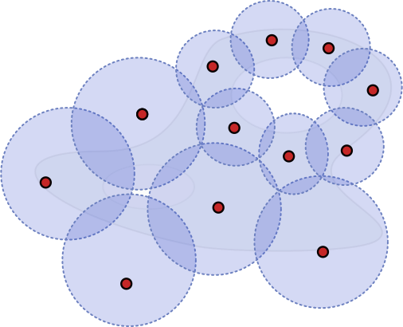
.footnote[.red.bold[\*]http://www.dyinglovegrape.com/math/topology_data_1.php]

]

---

.left-column[
## Nerve
### - Open cover
### - Add vertices
### - Add simplices
]
.right-column[
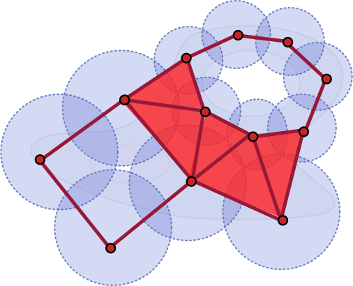
.footnote[.red.bold[\*]http://www.dyinglovegrape.com/math/topology_data_1.php]

]

---

.left-column[
## Nerve
### - Open cover
### - Add vertices
### - Add simplices
]
.right-column[
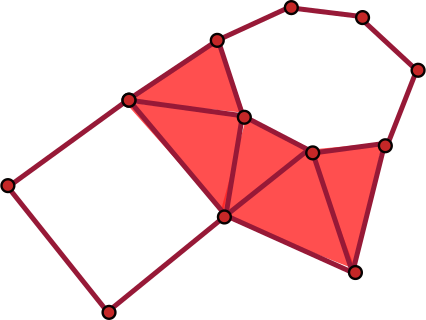

.footnote[.red.bold[\*]http://www.dyinglovegrape.com/math/topology_data_1.php]

]

---
.left-column[

]
.right-column[

  <!-- /the chart goes here -->

]

---

.left-column[
  ## Overlapping Intervals
]
.right-column[

  <!-- /the chart goes here -->

]

---

.left-column[
  ## Overlapping Intervals
  ## Partial Clustering
]

.right-column[

  <!-- /the chart goes here -->

]

---

.left-column[
  ## Overlapping Intervals
  ## Partial Clustering
]

.right-column[

  <!-- /the chart goes here -->

]

---

.left-column[
## Overlapping Intervals
## Partial Clustering
## Simplicial Complex
]
.right-column[

String them all together with a simplicial complex.
 - Each cluster is a vertex
 - If two clusters share points in common, connect them with a simplex.

Note: clusters will only share points if they are in adjacent intervals.
]

---

.left-half[

  <!-- /the chart goes here -->

]

.right-half[

]

---

.left-half[

  <!-- /the chart goes here -->

]

.right-half[

<!-- simplicial complex goes here -->

]

---

.left-half[

  <!-- /the chart goes here -->

]

.right-half[

<!-- simplicial complex goes here -->

]

---
name: last-page

That's it
